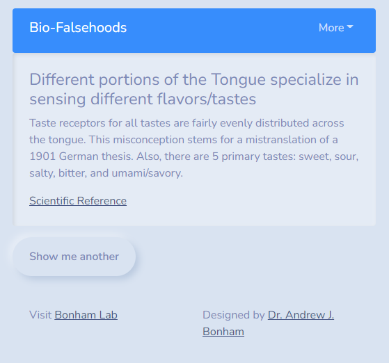

# bio-falsehoods

    

**bio-falsehoods** is an interactive web frontend to dispel common biology and biochemistry falsehoods circulated as fact.

This software is a work in progress, but try it live at [http://bio-falsehoods.bonhamcode.com/](http://bio-falsehoods.bonhamcode.com/)

## Screenshot

----------------------------------

## Authors

This software is developed as academic software by [Dr. Andrew J. Bonham](https://github.com/Paradoxdruid) at the [Metropolitan State University of Denver](https://www.msudenver.edu). It is licensed under the MIT license.
